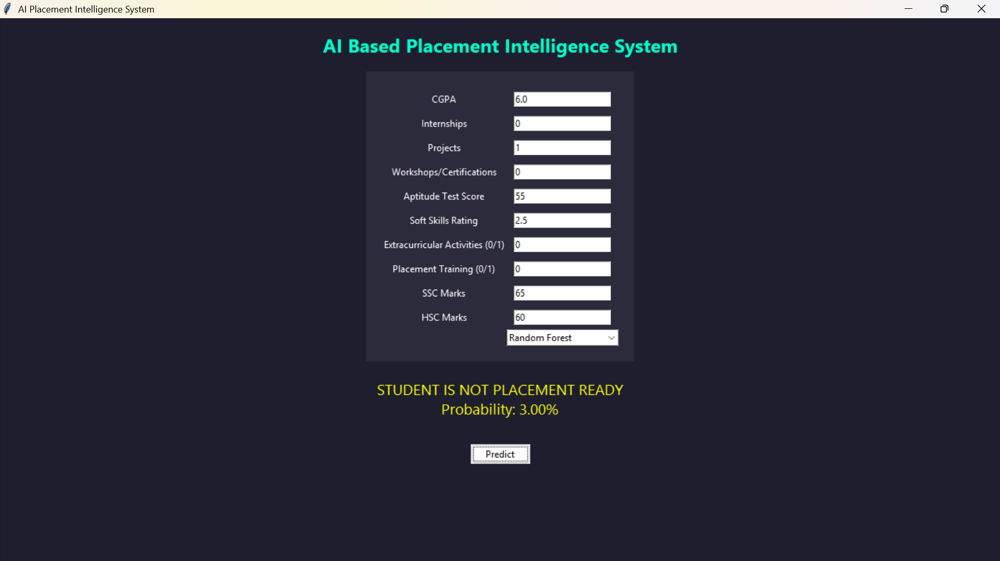

# AI Based Student Placement Readiness Prediction System

This project predicts whether a student is placement ready using Machine Learning algorithms.

## Models Used
- Random Forest
- Logistic Regression
- Support Vector Machine
- K Nearest Neighbors

## Features
- GUI based prediction system
- Multiple ML models
- Placement probability estimation
- Feature importance visualization

## Tech Stack
Python  
Scikit-learn  
Tkinter  
Pandas  
Matplotlib  

## Project Structure

```
Student-Placement-Readiness-Prediction-System
│
├── data
├── models
├── src
├── requirements.txt
├── README.md
└── .gitignore
```

## Example Input 1

CGPA: 7.5  
Internships: 1  
Projects: 2  
Workshops: 2  
Aptitude Score: 85  
Soft Skills Rating: 4.5  
Extracurricular Activities: 1  
Placement Training: 1  
SSC Marks: 78  
HSC Marks: 82  

## Output

STUDENT IS PLACEMENT READY  
Probability: 87.34%

## Example Input 2

Feature	Value
CGPA:	5.8
Internships:	0
Projects:	1
Workshops:	0
Aptitude:	55
Soft Skills:	2
Activities:	0
Training:	0
SSC:	60
HSC:	65

## Output 2

STUDENT IS NOT PLACEMENT READY
Probability: 32.15%

## GUI Results




Accuracy Achieved: 89.5% using Random Forest Classifier

## How to Run

Install dependencies

```
pip install -r requirements.txt
```

Train models

```
python src/train_model.py
```

Run GUI

```
python src/gui.py
```

## Author
Manan Pal  
B.Tech CSE