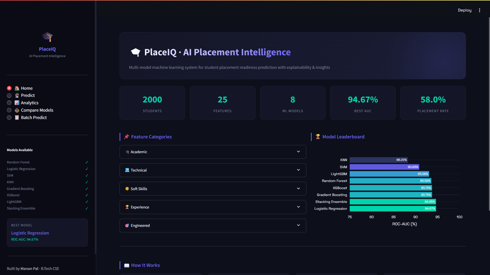
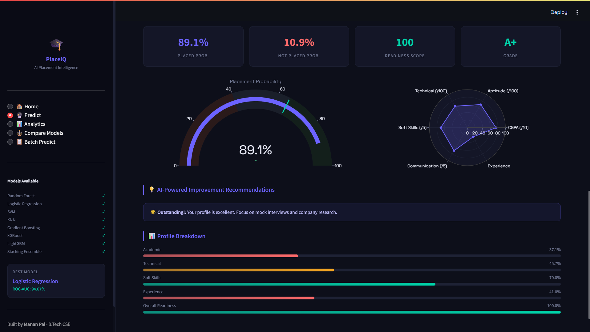
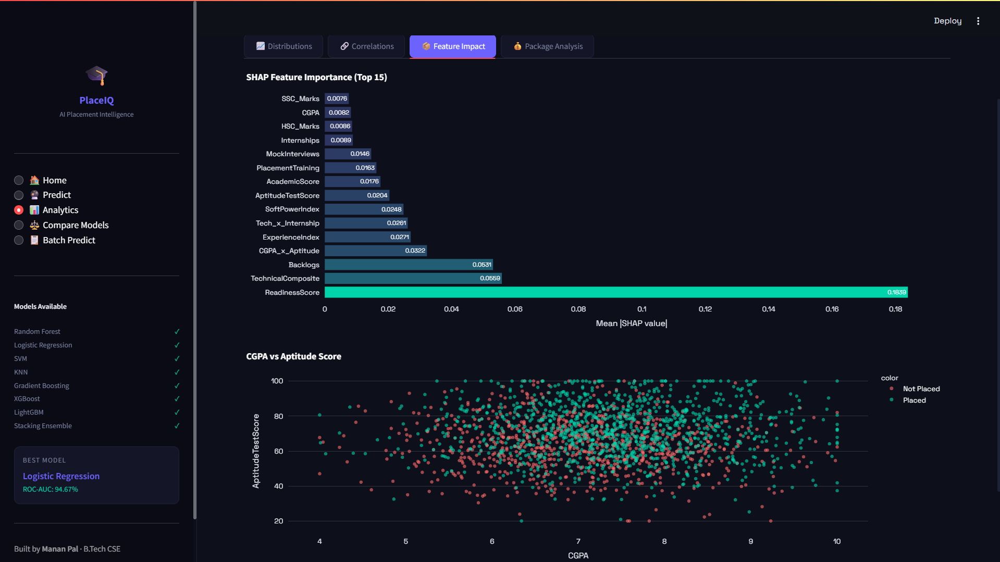
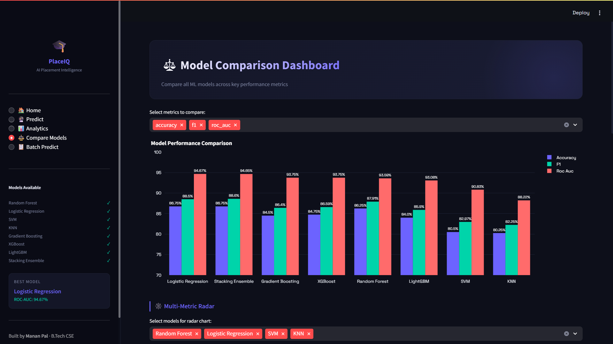
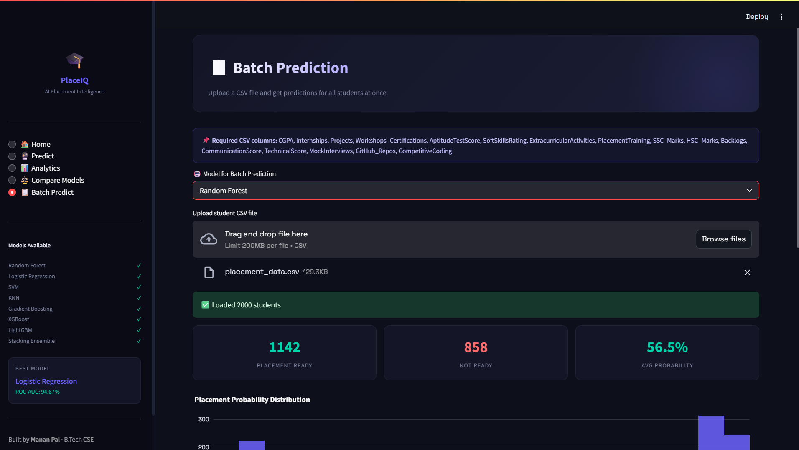

# 🎓 PlaceIQ · AI Placement Intelligence System

<p align="center">
  
  
  
  
  
</p>

<p align="center">
  A <strong>production-grade</strong> end-to-end Machine Learning system for predicting student placement readiness.<br/>
  Features <strong>8 ML models</strong>, <strong>25 engineered features</strong>, SHAP explainability, an interactive Streamlit dashboard, batch prediction, and a desktop GUI — all in one cohesive system.
</p>

---

## Screenshots

### Home — KPI Overview & Model Leaderboard


> The landing page shows live KPIs (total students, features, models, best ROC-AUC) and an interactive model leaderboard bar chart.

---

### Predict — Student Profile & Result


> Fill in a student's academic, technical, and soft-skill profile. The system returns a placement verdict, probability gauge, radar chart, and AI-generated improvement tips.

---

### Analytics — SHAP Feature Importance


> SHAP (TreeExplainer) reveals which features actually drive placement outcomes — not just correlations, but causal contribution scores.

---

### Compare Models — Radar & Metrics Table


> Side-by-side comparison of all 8 models across Accuracy, F1, ROC-AUC, and Brier Score — with an interactive radar overlay for visual benchmarking.

---

### Batch Predict — CSV Upload & Bulk Output


> Upload a CSV of any number of students and download a results file with placement verdict and probability for each.

---

## Key Highlights

| Feature | Details |
|---|---|
| **8 ML Models** | RF · LR · SVM · KNN · GBM · XGBoost · LightGBM · Stacking Ensemble |
| **25 Features** | 16 raw + 9 engineered composites (Academic, Technical, Soft Power, etc.) |
| **SHAP Explainability** | Per-feature SHAP importance with TreeExplainer |
| **SMOTE Balancing** | Handles class imbalance in training data |
| **Calibrated Probabilities** | Brier score tracked for probability quality |
| **Interactive Dashboard** | 5-page Streamlit app with Plotly visualisations |
| **Batch Prediction** | Upload CSV → get predictions for all students instantly |
| **Desktop GUI** | Tkinter GUI with sliders, tabs, and live results |
| **Model Leaderboard** | Side-by-side: Accuracy, F1, ROC-AUC, Brier |

---

## Model Performance (Test Set)

| Model | Accuracy | F1 | ROC-AUC |
|---|---|---|---|
| **Stacking Ensemble** | **86.75%** | **88.60%** | **94.65%** |
| Logistic Regression | 86.75% | 88.50% | 94.67% |
| Random Forest | 86.25% | 87.91% | 93.59% |
| Gradient Boosting | 84.50% | 86.40% | 93.75% |
| XGBoost | 84.75% | 86.59% | 93.75% |
| LightGBM | 84.00% | 85.90% | 93.08% |
| SVM | 80.50% | 82.97% | 90.83% |
| KNN | 80.25% | 82.25% | 88.22% |

---

## Project Structure

```
placement-readiness-prediction-ml
│
├── app.py                       ← Streamlit dashboard (5 pages)
├── requirements.txt
├── README.md
├── screenshots/                 ← README screenshots
│
├── data/
│   ├── placement_data.csv
│   └── generate_data.py
│
├── models/
│   ├── rf_model.pkl
│   ├── lr_model.pkl
│   ├── svm_model.pkl
│   ├── knn_model.pkl
│   ├── gb_model.pkl
│   ├── xgb_model.pkl
│   ├── lgb_model.pkl
│   ├── stacking_model.pkl
│   ├── scaler.pkl
│   ├── feature_names.pkl
│   ├── shap_data.pkl
│   └── model_metadata.json
│
└── src/
    ├── preprocess.py
    ├── train_model.py
    └── gui.py
```

---

## Feature Engineering (9 Engineered Features)

| Feature | Formula |
|---|---|
| `AcademicScore` | Weighted CGPA + SSC + HSC |
| `TechnicalComposite` | TechScore + Aptitude + GitHub + CodingRank + Projects |
| `SoftPowerIndex` | SoftSkills + Communication + Extracurricular + MockInterviews |
| `ExperienceIndex` | Internships + Workshops + PlacementTraining |
| `ReadinessScore` | Weighted composite of all 4 above (0–100 scale) |
| `CGPA_Band` | Ordinal encoding (0–5) of CGPA range |
| `CGPA x Aptitude` | Interaction term |
| `Tech x Internship` | Interaction term |
| `Soft x Communication` | Interaction term |

---

## Quick Start

```bash
git clone https://github.com/mananpal-dev/placement-readiness-prediction-ml.git
cd PlaceIQ
pip install -r requirements.txt

python data/generate_data.py
python src/train_model.py

# Full dashboard
streamlit run app.py

# Desktop GUI
python src/gui.py
```

---

## Dashboard Pages

| Page | Description |
|---|---|
| Home | KPI metrics, model leaderboard, feature categories |
| Predict | Form → gauge → radar → skill bars → AI tips |
| Analytics | Distributions, heatmap, SHAP importance, salary analysis |
| Compare Models | Metric table, radar overlay, confusion matrices |
| Batch Predict | Upload CSV → bulk predictions → download results |

---

## Tech Stack

| Layer | Technology |
|---|---|
| Language | Python 3.10+ |
| ML | Scikit-learn, XGBoost, LightGBM |
| Imbalance | imbalanced-learn (SMOTE) |
| Explainability | SHAP (TreeExplainer) |
| Dashboard | Streamlit + Plotly |
| GUI | Tkinter |
| Data | Pandas, NumPy |
| Persistence | Joblib |

---

## Author

**Manan Pal** · B.Tech Computer Science Engineering

<p>
  <a href="https://www.linkedin.com/in/mananpal-dev">
    
  </a>
  &nbsp;
  <a href="https://github.com/mananpal-dev">
    
  </a>
  &nbsp;
  <a href="https://manan-pal-portfolio.vercel.app">
    
  </a>
</p>

---

## License

MIT License — free to use, modify, and distribute with attribution.